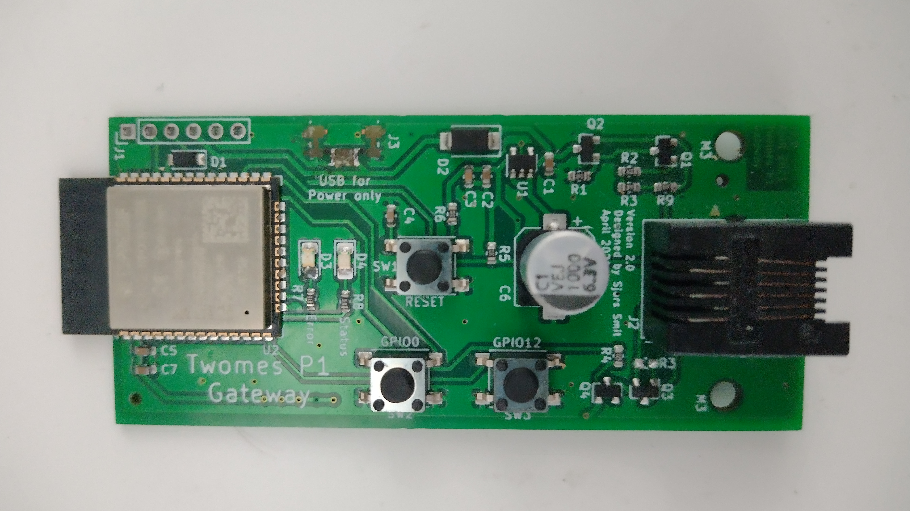
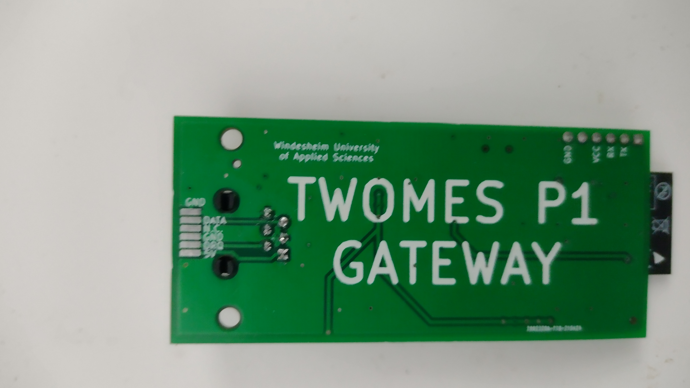

# Twomes P1 Gateway Hardware

This repository contains the open hardware design files for the Twomes P1 Gateway device, which can read measurement data from a smart meter adhering to the Dutch Smart Meter Requirements (DSMR). It can also receive data from various other Twomes 'satellite' measurement devices via the [ESP-NOW](https://www.espressif.com/en/products/software/esp-now/overview) protocol. The Twomes P1 Gateway can upload this measurement data to a Twomes server via Wi-Fi using secure HTTPS.

 

## Table of contents
* [General info](#general-info)
* [Producing](#producing)
* [Developing](#developing) 
* [Features](#features)
* [Status](#status)
* [License](#license)
* [Credits](#credits)

## General info
This repository will contains the hardware designs, such as schematics and board layout files for the Twomes P1 Gateway device.

The associated firmware that you can run on this device can be found in [this repository](https://github.com/energietransitie/twomes-p1-gateway-firmware).

## Producing

### Printed Circuit Board
To manufacture the printed circuit board you can use various PCB services. The folder [Output_files](./pcb/Output_files/FABRICATION) contains the necessary files. 

To have the PCBs manufactures via [JLCPCB](https://www.jlcpcb.com), the PCB manufacturer we used, upload the Gerber files in a zip to their [quote page](https://cart.jlcpcb.com/quote), select the amount of PCBs and a colour for silkscreen. All other options can be left on default. If SMT assembly is desired, also select this option before ordering. This will take you to a page where the BOM and POS file can be uploaded. Use the files [BOM_TwomesGatewayJLCPCB.csv](./pcb/Output_files/FABRICATION/BOM_AND_POS/BOM_TwomesGatewayJLCPCB.csv) and [TwomesGateway-top-pos.csv](./pcb/Output_files/FABRICATION/BOM_AND_POS/TwomesGateway-top-pos.csv).

### Enclosure
The folder [enclosure](./enclosure) contains both Fusion360 source files and exported STL files for the Twomes P1 Gateway enclosure. The STL files can be imported into any slicer and turned into G-Code for a 3D printer. You can also upload  the STL files to an online 3D printing service of your choice.

## Developing
To change the hardware designs, you need:
* [KiCad](https://www.kicad.org/download/) installed to change te PCB design. 

Some EDA tools may be able to convert the files, however this is not supported and may result in errors.

To export the modified PCBs, consult the webpage of your PCB manufacturer of choice for guidance on how to produce the output files. For example,  see the [JLCPCB guide on how to export Gerbers](https://support.jlcpcb.com/article/149-how-to-generate-gerber-and-drill-files-in-kicad) and the  [JLCPCB guide how to export the BOM and POS files](https://support.jlcpcb.com/article/84-how-to-generate-the-bom-and-centroid-file-from-kicad)

## Features
The Twomes P1 Gateway features:
* an ESP32 microcontroller;
* a female RJ12 connector for connection to the P1 port of a smart meter adhering to the Dutch Smart Meter Requirements (smart meters compatible to DSMR v5 provide enough power for the Twomes P1 gateway);
* USB input for a 5 V power supply (only needed for smart meters adhering to DSMR v4 and lower);
* FTDI compatible serial programming header (3,3 V).

## Status
Project is: _Ready for testing_

## License
The hardware designs in this repository are available under the [CERN-OHL-P v2 license](./LICENSE), Copyright 2021 [Research group Energy Transition, Windesheim University of Applied Sciences](https://windesheim.nl/energietransitie)

## Credits
This open hardware design made by:
* Sjors Smit · [@Shorts1999](https://github.com/Shorts1999)

Thanks also go to:
* Fredrik-Otto Lautenbag ·  [@Fredrik1997](https://github.com/Fredrik1997)
* Gerwin Buma ·  [@GerwinBuma](https://github.com/GerwinBuma) 
* Marco Winkelman · [@MarcoW71](https://github.com/MarcoW71)

Product owner:
* Marco Winkelman · [@MarcoW71](https://github.com/MarcoW71)

We use and gratefully acknowlegde the efforts of the makers of the following designs:
* [KiCad Libraries](https://kicad.github.io/), by the KiCad Development Team, licensed under [adapted version of the CC-BY-SA 4.0 License](https://www.kicad.org/libraries/license/)
