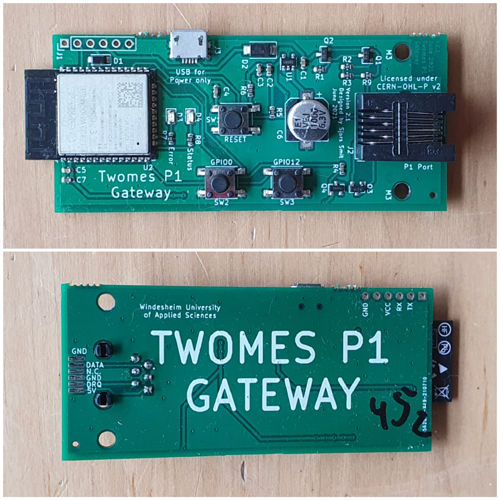
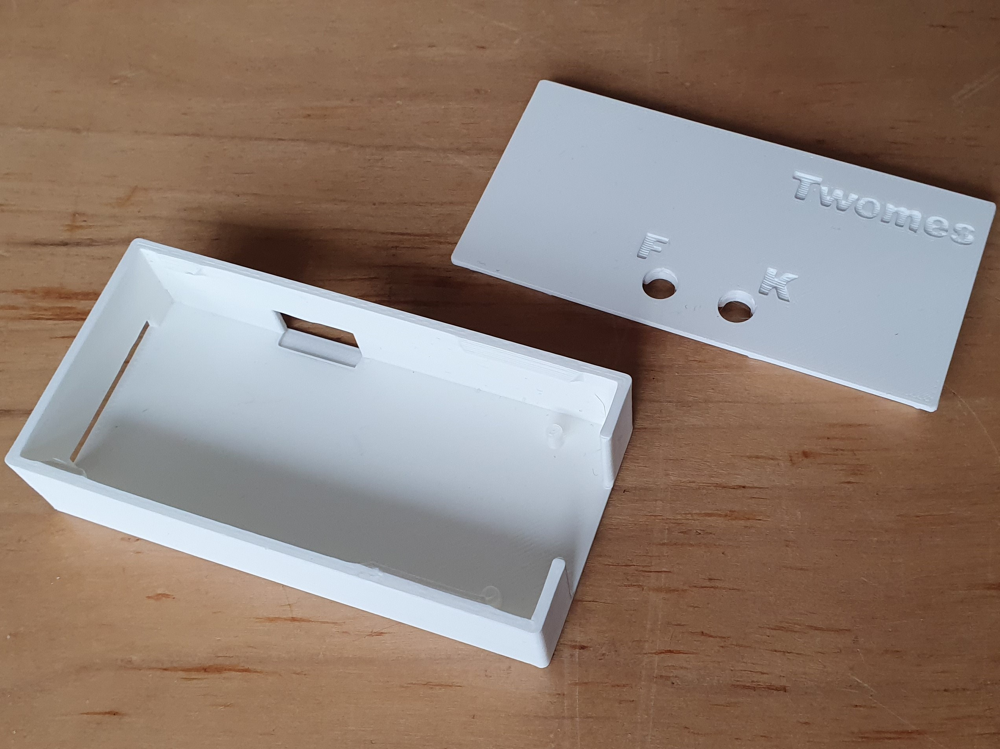

# Twomes P1 Gateway Hardware

This repository contains the open hardware design files for the Twomes P1 Gateway device, which can read measurement data from a smart meter adhering to the Dutch Smart Meter Requirements (DSMR). It can also receive data from various other Twomes 'satellite' measurement devices via the [ESP-NOW](https://www.espressif.com/en/products/software/esp-now/overview) protocol. The Twomes P1 Gateway can upload this measurement data to a Twomes server via Wi-Fi using secure HTTPS.

## Table of contents
* [General info](#general-info)
* [Producing](#producing)
* [Developing](#developing) 
* [Features](#features)
* [Status](#status)
* [License](#license)
* [Credits](#credits)

## General info
This repository contains the source files and fabrication files of the hardware designs of the Twomes P1 Gateway device and its enclosure. It also includes a `docs` folder with recent printouts of the [schematics](./docs/twomes-p1-gateway-sch.pdf) and [PCB layout](./docs/twomes-p1-gateway-pcb.pdf). 

You can run different kinds of firmware on this device:
- [twomes-p1-reader-firmware](https://github.com/energietransitie/twomes-p1-reader-firmware), if you need it to work on a server that supports v2 of the Twomes API.
- [twomes-p1-gateway-firmware](https://github.com/energietransitie/twomes-p1-gateway-firmware), if you need the device to serve as a gateway for the [twomes-room-monitor](https://github.com/energietransitie/twomes-room-monitor-firmware) and/or [twomes-boiler-monitor](https://github.com/energietransitie/twomes-boiler-monitor-firmware).

## Producing

### Printed Circuit Board
To fabricate the printed circuit board you can use various PCB services. 

The folder [pcb/jlcpcb](./pcb/jlcpcb) includes all exported files needed to have the PCBs manufactured by [JLCPCB](https://www.jlcpcb.com). Upload the [zipped gerber files](./pcb/jlcpcb/gerber-TwomesGateway.zip) to the [JLCPCB quote page](https://cart.jlcpcb.com/quote), select the amount of PCBs and a colour for the silkscreen. All other options can be left on default. If SMT assembly is desired, also select this option before ordering. This will take you to a page where the BOM and POS file can be uploaded. Use the files [BOM-TwomesGateway.csv](./pcb/jlcpcb/assembly/BOM-TwomesGateway.csv) and [CPL-TwomesGateway.csv](./pcb/jlcpcb/assembly/BOM-TwomesGateway.csv).

N.B. All components marked "DO NOT PLACE" in the BOM-*.csv file can not be ordered from JLCPCB and need to be ordered from other services and placed manually.

### Enclosure
To fabricate the enclosure you can use your own 3D printer or use a 3D printing service. 

The folder [enclosure/fabrication](./enclosure/fabrication) contains exported STL files for the [case](./enclosure/fabrication/twomes-p1-gateway-enclosure-case.stl), the [lid](./enclosure/fabrication/twomes-p1-gateway-enclosure-lid.stl) and the [button](./enclosure/fabrication/twomes-p1-gateway-enclosure-button.stl) of the Twomes P1-gateway enclosure. The STL files can be imported into any slicer and turned into G-Code for a 3D printer.

## Developing

### Printed Circuit Board
To change the hardware design of the PCB, you need:
* [KiCad](https://www.kicad.org/download/) installed to change te PCB design. 

The KiCad source files of the PCB can be found in the folder [pcb](./pcb).

To convert the PCBs into a format suitable for fabrication, consult the webpage of your PCB manufacturer of choice. For example, see the [JLCPCB guide on how to export Gerbers](https://support.jlcpcb.com/article/149-how-to-generate-gerber-and-drill-files-in-kicad) and the  [JLCPCB guide how to export the BOM and POS files](https://support.jlcpcb.com/article/84-how-to-generate-the-bom-and-centroid-file-from-kicad). You may also use a KiCad plug-in for this purpose such as [kicad-jlcpcb-tools](https://github.com/Bouni/kicad-jlcpcb-tools).

### Enclosure
To change the hardware design of the enclosure, you need either:
* [Autodesk Fusion 360](https://www.kicad.org/download/) installed (Autodesk provides 30 day free trials and [free one-year educational access](https://www.autodesk.com/education/edu-software/overview?sorting=featured&filters=individual) to its products and services for eligible students, teachers and research staff); 
* or [FreeCAD](https://www.freecadweb.org/), an open source alternative.

The source files of the enclosure can be found in the folder [enclosure](./enclosure). We include both .f3d source files and .step source files we obtained after conversion.
## Features
The Twomes P1 Gateway features the following main hardware components:
* [ESP32-WROOM-32E](https://www.espressif.com/sites/default/files/documentation/esp32-wroom-32e_esp32-wroom-32ue_datasheet_en.pdf) module;
* female RJ12 connector for connection to the P1 port of a smart meter adhering to the Dutch Smart Meter Requirements (smart meters compatible with DSMR v5 provide enough power for the Twomes P1 gateway);
* micro USB input for a 5 V power supply (only needed for smart meters adhering to DSMR v4 and lower);
* FTDI compatible serial programming header (3.3 V).

## Status
Project is: _in progress_

## License
The hardware designs in this repository are available under the [CERN-OHL-P v2 license](./LICENSE), Copyright 2022 [Research group Energy Transition, Windesheim University of Applied Sciences](https://windesheim.nl/energietransitie)

## Credits
This open hardware design made by:
* Sjors Smit · [@Shorts1999](https://github.com/Shorts1999)

Thanks also go to:
* Fredrik-Otto Lautenbag ·  [@Fredrik1997](https://github.com/Fredrik1997)
* Gerwin Buma ·  [@GerwinBuma](https://github.com/GerwinBuma) 
* Marco Winkelman · [@MarcoW71](https://github.com/MarcoW71)

Product owner:
* Marco Winkelman · [@MarcoW71](https://github.com/MarcoW71)

We use and gratefully acknowlegde the efforts of the makers of:
* [KiCad Libraries](https://kicad.github.io/), by the KiCad Development Team, licensed under [an adapted version of the CC-BY-SA 4.0 License](https://www.kicad.org/libraries/license/)
