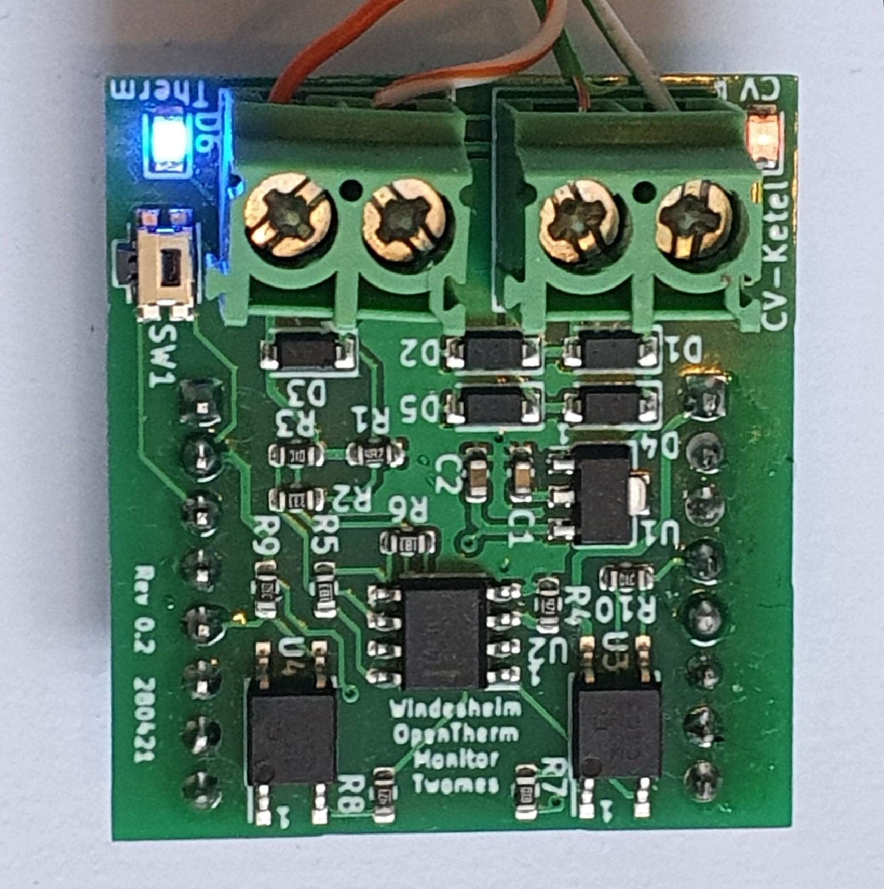

# Twomes P1 Gateway Hardware

This repository contains the open hardware design files for the Twomes P1 Gateway device, this is a dedicated device, which can wirelessly receive data from various other Twomes sensor using ESP-Now, and can connect to the P1 port of a Dutch smart energy meter, to receive data.
The Twomes P1 Gateway can send this data to the Twomes Backoffice database using secure HTTPS.
The P1 Gateway is uses an ESP32 Microcontroller and can be powered either directly through the P1 port itself on DSMR version 5.0^, or through a seperate USB port on DSMR version 4.x Smart Meters

 

## Table of contents
* [General info](#general-info)
* [Prerequisites](#prerequisites)
* [Producing](#producing)
* [Developing](#developing) 
* [Features](#features)
* [Status](#status)
* [License](#license)
* [Credits](#credits)

## General info
This repository will contain the hardware designs, such as schematics and board layout files for the Twomes P1 Gateway device.

For the associated firmwware that you can run on this device, please see [this repository](https://github.com/energietransitie/twomes-opentherm-gateway-diyless).

## Prerequisites
Describe which hardware and software you need to produce and/or develop the hardawre. If the prerequisites are different for users that only wish to produce hardware versus uers that (also) wish to develop new versions of the hardware, you may want to move the prerequisites section as a subsection of each of those sections.

## Producing

Describe how the reader use the files contained in this repository to produce the PCB hardware and enclusure(s). 

### Printed Ciruit Board
Document how to order (small) series of PCBs from a PCB fabrication service, including SMT assembly if the design calls for it. Use steps if the procedure is non-trivial:
1. first step;
2. second step;
3. final step.

Format any scripts or commands in a way that makes them  easy to copy, like the following example. 

Forgotten your Wi-Fi password? No problem with the follwing command, replacing `SSID` with the Wi-Fi name of your own Wi-Fi network: 
```shell
netsh wlan show profile SSID key=clear
```
### Enclosure
Document how to print (small) series of enclosures, e.g. on a 3D printer, and/or how to order enclusures, e.g. from a 3D printing service. Use steps if the procedure is non-trivial:
1. first step;
2. second step;
3. final step.

Format any scripts or commands in a way that makes them  easy to copy, like the following example. 

Forgotten your Wi-Fi password? No problem with the follwing command, replacing `SSID` with the Wi-Fi name of your own Wi-Fi network: 
```shell
netsh wlan show profile SSID key=clear
```

## Developing
Describe how the reader can change or extend the harware design. 

## Features
List of features ready and TODOs for future development. Ready:
* awesome feature 1;
* awesome feature 2;
* awesome feature 3.

To-do:
* wow improvement to be done 1;
* wow improvement to be done 2.

## Status
Project is: _in progress_

## License
The hardware designs in this repository are available under the [CERN-OHL-P v2 license](./LICENSE.md), Copyright 2021 [Research group Energy Transition, Windesheim University of Applied Sciences](https://windesheim.nl/energietransitie)

## Credits
This open hardware design is a collaborative effort of:
* Sjors Smit · [@Shorts1999](https://github.com/Shorts1999)
* <contributor name 2> · [@Github_handle_2](https://github.com/<github_handle_2>) · Twitter [@Twitter_handle_2](https://twitter.com/<twitter_handle_2>)
* <contributor name 3> · [@Github_handle_3](https://github.com/<github_handle_3>) · Twitter [@Twitter_handle_3](https://twitter.com/<twitter_handle_3>)

Thanks also go to:
* Marco Winkelman · [@MarcoW71](https://github.com/MarcoW71)

Product owner:
* Marco Winkelman · [@MarcoW71](https://github.com/MarcoW71)

We use and gratefully aknowlegde the efforts of the makers of the following designs:

* [KiCad](https://www.kicad.org), licensed under [GNU GPL v3](http://www.gnu.org/licenses/gpl-3.0.en.html)

